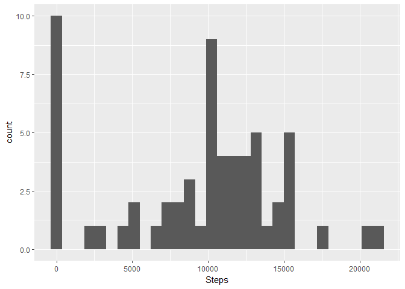
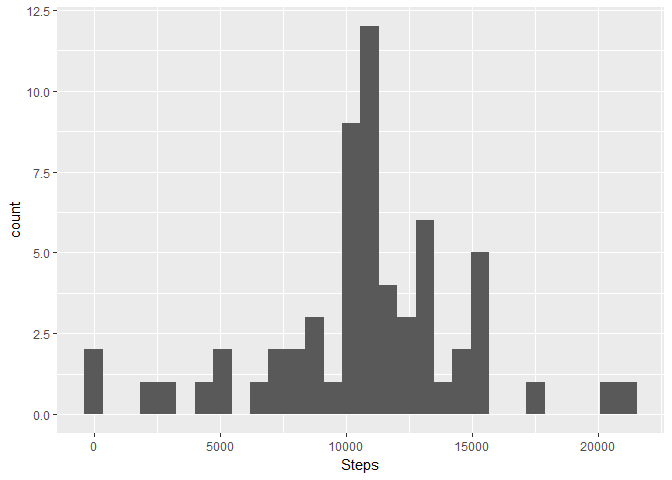

# Reproducible Research: Peer Assessment 1


## Loading and preprocessing the data
The dplyr package will be used for the data processing during these exercises and the plots will be created using ggplot2. The required packages are 


```r
library(dplyr)
library(ggplot2)
library(lubridate)
library(xtable)
library(knitr)
```

###Load the data
The dataset for this analysis contains 17568 observations of 3 variables:  
- steps: the number of steps taken during a 5 minute interval  
- date: the date that the data was collected  
- interval: the 5 minute interval during the date  
  
###Data Transformations
Two data transformations need to be done to the base data table to get ready for the analysis.  
1. Cast the date field to a Date data type  
2. Add a column named day_type that will hold a factor labeling a day as a weekday or weekend  

```r
act_tbl <- tbl_df(read.csv("activity.csv"))
act_tbl$date <- as.Date(act_tbl$date)
act_tbl <- mutate(act_tbl, day_type=as.factor(ifelse(weekdays(date) %in% c("Saturday", "Sunday"), "Weekend", "Weekday")))
```

###Data Grouping
Grouped data tables are created to make it easier to get information.

```r
act_groupby_date <- group_by(act_tbl, date)
act_groupby_day <- group_by(act_tbl, wday(date, label=TRUE, abbr=FALSE))
act_groupby_interval <- group_by(act_tbl, interval)
act_groupby_daytype <- group_by(act_tbl, day_type)
```

###Summary Tables
And, finally, summarization tables are created.

```r
act_day_summary <- summarize(act_groupby_day, mean=mean(steps, na.rm=TRUE), 
                             median=median(steps, na.rm=TRUE), 
                             total=sum(steps, na.rm=TRUE))

act_daily_summary <- summarize(act_groupby_date, mean=mean(steps, na.rm=TRUE), 
                               median=median(steps, na.rm=TRUE), 
                               total=sum(steps, na.rm=TRUE))

act_interval_summary <- summarize(act_groupby_interval, mean_steps=mean(steps, na.rm=TRUE))
```
## What is mean total number of steps taken per day?
The histogram below show the frequency of the total steps taken each day.   

```r
qplot(total, data=act_daily_summary, geom="histogram", xlab="Steps")
```

<!-- -->

```r
total_mean <- mean(act_daily_summary$total, na.rm=TRUE)
total_median <- median(act_daily_summary$total, na.rm=TRUE)
```

The overall total mean number of steps taken is 9354.2295082 and the overall total median number of steps taken is 10395.   

The table below shows the daily mean and median steps taken.   

```r
kable(act_daily_summary[,1:3], col.names=c("Date", "Daily Mean", "Daily Median"), caption="Daily Steps Mean and Median")
```


Table: Daily Steps Mean and Median

Date          Daily Mean   Daily Median
-----------  -----------  -------------
2012-10-01           NaN             NA
2012-10-02     0.4375000              0
2012-10-03    39.4166667              0
2012-10-04    42.0694444              0
2012-10-05    46.1597222              0
2012-10-06    53.5416667              0
2012-10-07    38.2465278              0
2012-10-08           NaN             NA
2012-10-09    44.4826389              0
2012-10-10    34.3750000              0
2012-10-11    35.7777778              0
2012-10-12    60.3541667              0
2012-10-13    43.1458333              0
2012-10-14    52.4236111              0
2012-10-15    35.2048611              0
2012-10-16    52.3750000              0
2012-10-17    46.7083333              0
2012-10-18    34.9166667              0
2012-10-19    41.0729167              0
2012-10-20    36.0937500              0
2012-10-21    30.6284722              0
2012-10-22    46.7361111              0
2012-10-23    30.9652778              0
2012-10-24    29.0104167              0
2012-10-25     8.6527778              0
2012-10-26    23.5347222              0
2012-10-27    35.1354167              0
2012-10-28    39.7847222              0
2012-10-29    17.4236111              0
2012-10-30    34.0937500              0
2012-10-31    53.5208333              0
2012-11-01           NaN             NA
2012-11-02    36.8055556              0
2012-11-03    36.7048611              0
2012-11-04           NaN             NA
2012-11-05    36.2465278              0
2012-11-06    28.9375000              0
2012-11-07    44.7326389              0
2012-11-08    11.1770833              0
2012-11-09           NaN             NA
2012-11-10           NaN             NA
2012-11-11    43.7777778              0
2012-11-12    37.3784722              0
2012-11-13    25.4722222              0
2012-11-14           NaN             NA
2012-11-15     0.1423611              0
2012-11-16    18.8923611              0
2012-11-17    49.7881944              0
2012-11-18    52.4652778              0
2012-11-19    30.6979167              0
2012-11-20    15.5277778              0
2012-11-21    44.3993056              0
2012-11-22    70.9270833              0
2012-11-23    73.5902778              0
2012-11-24    50.2708333              0
2012-11-25    41.0902778              0
2012-11-26    38.7569444              0
2012-11-27    47.3819444              0
2012-11-28    35.3576389              0
2012-11-29    24.4687500              0
2012-11-30           NaN             NA

## What is the average daily activity pattern?
Average Number of Steps per Interval

```r
qplot(interval, mean_steps, data=act_interval_summary, geom="line", xlab="Interval", ylab="Average Number of Steps")
```

<!-- -->

Now to compute the interval with the maximum number of steps:

```r
max_steps <- max(act_interval_summary$mean_steps, na.rm=TRUE)
max_interval <- filter(act_interval_summary, mean_steps == max_steps)
```
The interval with the maximum number of steps was interval 835 with an average of 206.1698113 steps.   

## Imputing missing values

```r
na_count <- sum(is.na(act_tbl$steps))
```

There are 2304 missing values for the steps variable. The strategy used to impute missing or NA values for the step variable is to replace the NA with the overall mean value for the interval.  
   
Once the steps values have been imputed, some of the grouping and summary tables are recreated to perform a comparison.  

```r
act_tbl_imp <- merge(act_tbl, act_interval_summary, by="interval")
act_tbl_imp$steps <- apply(act_tbl_imp, 1, function(row){ ifelse(is.na(row[2]), row[5], row[2])})
act_tbl_imp$steps <- as.numeric(act_tbl_imp$steps)
act_tbl_imp <- mutate(act_tbl_imp, day_type=as.factor(ifelse(weekdays(date) %in% c("Saturday", "Sunday"), "Weekend", "Weekday")))

act_imp_groupby_date <- group_by(act_tbl_imp, date)
act_daily_summary <- summarize(act_imp_groupby_date, mean=mean(steps, na.rm=TRUE), median=median(steps, na.rm=TRUE), total=sum(steps, na.rm=TRUE))
```

Now plot the same histogram as above, with the imputed values.

```r
qplot(total, data=act_daily_summary, geom="histogram", xlab="Steps")
```

```
## `stat_bin()` using `bins = 30`. Pick better value with `binwidth`.
```

<!-- -->
The histogram with the imputed values has a very similar shape and distribution as the histogram with the missing values of steps. The main difference is in the frequency of zero on the histogram.   

## Are there differences in activity patterns between weekdays and weekends?
The plots below show that while the Weekday and Weekend patterns are similar, the Weekday pattern does show a peak around the 800 interval and then lower average steps throughout the day. The Weekend does still show a peak around the 800 interval, but it is not much higher than some of the other peaks and the differences between the peaks and valleys are not as large as the Weekday.


```r
ggplot(act_tbl_imp, aes(x=interval, y=steps)) + stat_summary(aes(y=steps, group=1), fun.y=mean, geom="line", group=1) + facet_grid(day_type~.)
```

<!-- -->
